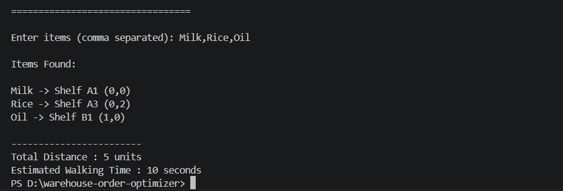

# Warehouse Inventory and Order Optimizer

## About the Project

This project is a Python-based warehouse inventory and order optimizer. It reads product information from a CSV file, identifies the shelf locations of products entered by the user, calculates the total travel distance, and estimates the walking time required to collect the selected products.

I developed this project to improve my understanding of Python programming, file handling, dictionaries, and basic warehouse logistics while building a simple real-world application.

---
## Project Screenshot



## Features

- Read product information from a CSV file
- Search for one or more products
- Display shelf locations and coordinates
- Calculate total travel distance
- Estimate walking time
- Display a message when a product is not available

---

## Technologies Used

- Python 3
- CSV Module (Built-in Python Library)

---

## Project Files

- **main.py** – Main Python program
- **products.csv** – Warehouse inventory data
- **README.md** – Project documentation
- **requirements.txt** – Project requirements
- **LICENSE** – MIT License

---

## How to Run

1. Open the project folder in VS Code.
2. Open the terminal.
3. Run the following command:

```bash
python main.py
```

4. Enter product names separated by commas.

Example:

```
Milk,Rice,Oil
```

---

## Sample Output

```
=================================
 Warehouse Order Optimizer
=================================

Enter items (comma separated):
Milk,Rice,Oil

==============================
 Warehouse Pickup Report
==============================

Milk -> Shelf A1 (0,0)
Rice -> Shelf A3 (0,2)
Oil -> Shelf B1 (1,0)

==============================
Total Distance : 5 units
Estimated Walking Time : 10 seconds
```

---

## Skills Demonstrated

- Reading and processing CSV files
- Using dictionaries for data lookup
- Working with loops and conditional statements
- Accepting and processing user input
- Implementing basic distance calculations
- Writing clean and readable Python code

---

## Future Improvements

- Optimize the pickup route using a shortest-path algorithm
- Add a graphical user interface
- Store inventory in a database
- Add barcode scanner support
- Improve warehouse visualization

---

## Author

Sharvin Nikhash

B.E. Robotics and Automation

PSG College of Technology